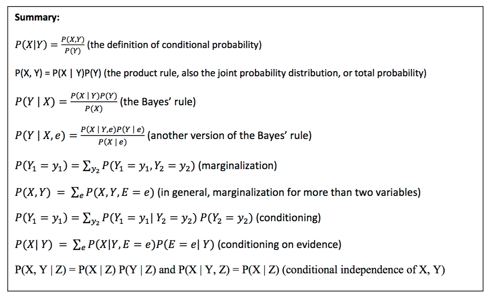

Project Description

# Dataset Preparation Steps
1. scraped images from bing for different kinds of road signs
2. filtered out all the incorrect ones
3. resized to 16x16 with color and 32x32 in grayscale
4. normalized the pixel values to be in range of 0  to 1.0
5. extracted the value for each pixel and wrote it to a .bin file in order to read it as input to our neural network

# Traffic Signs Encoding
We used the following encoding to store traffic sign data.

Crosswalk - 0 
No Parking -1 
Railroad - 2 
Speed Limit -3 
Stop sign - 4 
Yield -5 

# CSCI_580
A place for resources for AI.

## Formulas:

